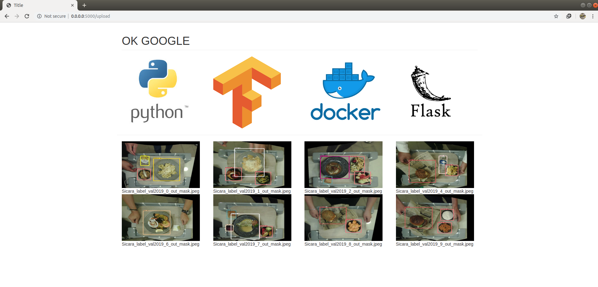
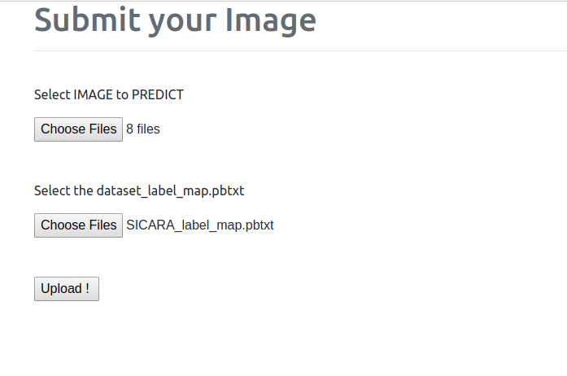

# RHYMESDATASET + Tensorflow Object Detection API
This repository is a guide to illustrate the different step that are requiered to obtain a Tf\_object_detection model from a Rhymes dataset to the deployement of this.

TensorFlow’s Object Detection API is a very powerful tool that can quickly enable anyone to build and deploy powerful image recognition software.

The goal is to detect all instances of objects from a known class, such as people, cars, faces, or a type of food in a given image. For this purpose we can use different prominent algorithms for detection such as Fast Region-based Convolutional Neural Network (Fast R-CNN), Faster Region-based Convolutional Neural Network (Faster R-CNN), Mask R-CNN... But before we need to convert our dataset format to the format that can be accepted by the Tensorflow' Object detection API, ie in coco_format.

Depending on the algorithms type we can obtains an image with bounding box or a mask (polygon).

And finally to deploy the model, we 'll use a the TensorFlow Serving serving system combine with a Flask web framework.

<p align="center">
  
</p>

**TABLE OF CONTENTS:**
======================
- [REQUIREMENTS :](#requirements)
- [INSTALLATION :](#installation--)
	* [Install Tensorflow Object Detection API](#install-tensorflow-object-detection-api)
- [STEP:](#step-)
	* [Step 1: Convert Rhymes_dataset to Cocoformat](#step-1)
	* [Step 2: Run a trainning process Locally](#step-2)
	* [Step 3: Export the model To create models ready for serving using export_model.py](#step-3)
	* [Step 4: Deploying Object Detection Model with TensorFlow Serving - Flask - Docker](#step-4)
	* [Step 5: Run the app](#step-5)

<a name="requirements"></a>
# REQUIREMENTS :
1. Python, TensorFlow 1.12, Pandas, Docker and other common packages listed in requirements.txt.
2. You also need :
	* pycocotools
	* the Tensorflow Object Detection API
3. A valid Rhymes dataset in a csv file and the category csv file who contains the differents class in the dataset.

<a name="installation--"></a>
# INSTALLATION :

1. Clone this repository

2. Install dependencies

```
	pip install -r requirement.txt 
```


3. Install pycocotools from one of these repos.
	* Linux: https://github.com/waleedka/coco
	* Windows: https://github.com/philferriere/cocoapi. 
	You must have the Visual C++ 2015 build tools on your path (see the repo for additional details)

    ##### Install Tensorflow Object Detection API
4. Protobuf Compilation

The Tensorflow Object Detection API uses Protobufs to configure model and training parameters. Before the framework can be used, the Protobuf libraries must be compiled. This should be done by running the following command from the tensorflow/models/research/ directory:

```
	protoc object_detection/protos/*.proto --python_out=.
```
5. Add Libraries to PYTHONPATH

```
	# from Documentation_tfobject/
	export PYTHONPATH=$PYTHONPATH:`pwd`:`pwd`/slim
```
6. Install Docker

<a name="step-"></a>
# STEP:
<a name="step-1"></a>
### Step 1: Convert Rhymes_dataset to Cocoformat
For the aim of using the rhymes dataset in the trainning step, we need to convet this to the cocoformat. ie the annotation must be formatted in JSON and contains a collection of “info”, “licenses”, “images”, “annotations”, “categories”.

* Change to the Rhymes_to_coco directories
* Create the the labels.txt file. Where the first two lines are "\_\_ignore\__" and "Background". And in the over line the differents class in the dataset .
* Convert the dataset csv file into Coco_format with
```
	Rhymes2Coco_format.py
```
It will Split the dataset into Train and Validation set by giving the "test_size" proportion. It also generates automaticaly the Train and Val folder.
* Convert the COCO_format dataset to TFRecord with
```
	create_coco_tf_record.py
```
Don't forget the 'include_mask' argument.

<a name="step-2"></a>
### Step 2: Run a trainning process Locally
* Create the label_map file with :
```
	python create_label_map.py \
	--dataset_name = dataset_name \
        --cat_file_dir = path/to/the_category/file.csv \
        --output_path = path/to/save/the_pbtxt/file/
```
* Need an Object detection pipeline configuration file. See [this page](https://github.com/tensorflow/models/blob/master/research/object_detection/g3doc/configuring_jobs.md) for details on how to write a pipeline configuration.

* Download a pre-trained  object detection models on COCO dataset weight from the [Tensorflow detection model zoo](https://github.com/tensorflow/models/blob/master/research/object_detection/g3doc/detection_model_zoo.md)

* Recommended Directory Structure for Training and Evaluation

```
	+data
	  -label_map file
	  -train TFRecord file
	  -eval TFRecord file
	+models
	  + model
	  + config
	    -pipeline config file
	  + pre_trained_model
	    
```

* Running the Training Job

A local training job can be run with the following command:

```
	PIPELINE_CONFIG_PATH={path to pipeline config file}
	MODEL_DIR={path to model directory}
	NUM_TRAIN_STEPS=50000
	SAMPLE_1_OF_N_EVAL_EXAMPLES=1
	python object_detection/model_main.py \
	    --pipeline_config_path=${PIPELINE_CONFIG_PATH} \
	    --model_dir=${MODEL_DIR} \
	    --num_train_steps=${NUM_TRAIN_STEPS} \
	    --sample_1_of_n_eval_examples=$SAMPLE_1_OF_N_EVAL_EXAMPLES \
	    --alsologtostderr	
```

where ${PIPELINE_CONFIG_PATH} points to the pipeline config and ${MODEL_DIR} points to the directory in which training checkpoints and events will be written to. Note that this binary will interleave both training and evaluation.

* Monitor Training Job Progress using TensorBoard

You can continuously monitor and visualise a number of different training/detection performance metrics, while your model is being trained. The specific tool that allows us to do all that is **Tensorboard**.
Run the following command:
```
	tensorboard --logdir=${MODEL_DIR}
```

<a name="step-3"></a>
### Step 3: Export the model To create models ready for serving using export_model.py
After you have trained your object detection model using TensorFlow, you will have the following four files saved in your disk:
```
	* checkpoint
	* model.ckpt.data-00000-of-00001
	* model.ckpt.index
	* model.ckpt.meta
```
These files can be used for inference directly or we can use freeze_graph.py script to convert the model into a frozen graph consisting of the model architecture and weights in one file. This is useful for testing purposes on your local machine but not suitable for a production environment.

To create models ready for serving use :

```
    # from  Export_a_model/
python export_model.py \
    --input_type encoded_image_string_tensor \
    --pipeline_config_path path/to/ssd_inception_v2.config \
    --trained_checkpoint_prefix path/to/model.ckpt \
    --output_directory path/to/exported_model_directory\
    --model_version_id 1
```

In the output\_directory/1/ you should have **_variables_** folder and **_saved\_model.pb_** file which contains respectively the weights for the model and the model architecture. This model is ready to be served.

<a name="step-4"></a>	
### Step 4:Deploying Object Detection Model with TensorFlow Serving - Flask - Docker
Usually when making an API public we use HTTP(S) and REST but not with gRPC and protobufs. In order to deploy our model with the advantage of using gRPC and Protobufs and direct use of classes generated from Protobufs , we use an approach composed by a Web server that hosts a TensorFlow Serving client and a TensorFlow Server that provides gRPC interface only.

The web server receives REST requests from the outside, transforms them into protobufs, sends them to the Tensorflow server and transforms results back.

Image
<p align="center">
  
</p>

1- Create the Tensorflow server with the model:
	- *Build the container using the official tf_serving docker image*

First clone the repository
```
    cd ~
    git clone https://github.com/tensorflow/serving.git
```
Build Docker image and run container
```
     # Move to the directory of the docker files
    cd ./serving/tensorflow_serving/tools/docker/
    
     # Build the image (CPU)
    docker build --pull -t $USER/tensorflow-serving-devel-cpu -f Dockerfile.devel .
    
    or 
    
     # Build the image (GPU)
    docker build --pull -t $USER/tensorflow-serving-devel-gpu -f Dockerfile.devel-gpu .
 ```
It takes about an hour or more to download dependencies and build the image… 

Now we can run Docker container:

```
    docker run --name=tf_container_cpu -it $USER/tensorflow-serving-devel-cpu
```
If everything works as expected, congratulations! You are now in the Shell of TensorFlow Serving Docker container.

	- *copy the model in the container*

First create a working directory
from shell in the running container:
```
    cd serving
    mkdir Sicara_project
```
Copy the exported model (see step 3) into TensorFlow container. From Shell on your PC:

```
	cd <path to exported_model_directory project>
	docker cp ./1 7ff0abed7538:/tensorflow-serving/serving/Sicara_project
```

You should have the exported model folder in the container. From the Shell:

```
    cd /serving
    ls ./Sicara_project/1
```
You should see the variables folder and saved_model.pb file.

	- *commit the change to create a new docker image*

Now we can create Docker image from our container:
```
    docker commit 7ff0abed7538 $USER/tensorflow-serving-sicara:v1.0
```

	- *push this docker image to dockerhub ==> TensorFlow Server who host the model*

Login to your dockerhub account
```
	docker login
```
tag your image 
```
	docker tag image\_name yourhubusername/tensorflow-serving-server-sicara:firsttry
```
Push the image
```
	docker push yourhubusername/tensorflow-serving-server-sicara
```

2- Create the Web server with the Tensorflow Serving Client by using Flask web application

In this part we create the client that is able “talk” over TensorFlow Serving works on gRPC protocol (tf_serving_sicara_client), use Flask as Web framework to host my TensorFlow client (api_meero.py) and Dockerize the Flask application.
	- *change directory to RESTPLUS*

In the RESPLUS_TEST directory you 'll see the following folder and file:

     - api_meero.py:entry point of the application. Here you find configuration and initialization steps.

     - settings.py: setting contstants.

     - requirement: contains the dependencies to install for the app.

     - tensorflow_serving/: this folder contains TensorFlow Serving API, which is generated from TensorFlow protobufs.

     - api/gan/: this sub-folder contains  logic for prediction.

     - /api/gan/logic/tf_serving_client.py: TensorFlow client that sends requests to and pre-processes responses from TensorFlow server.

     - /api/gan/logic/utils/fonction_util.py : contains different function to use in the prediction.

     - templates/: contains static data as well as placeholders for dynamic data used by Flask.

     - doc/ : folder for the 

     - upload_folder/: contains the file that are upload from the app.

     - output/: output file predicted 

	- *Dockerize the Flask application (dockerfile)*
```
    cd to the restplus
    docker build -t $USER/tensorflow-serving-client:latest .
```
	- *push to dockerhub*

<a name="step-5"></a>
### Step 5: Run the app
* Use DOCKER COMPOSE to run the TensorFlow server and the Flask application together

For  purpose  you need a docker-compose YAML configuration file, where you specify the services (Docker image name, container name, expose ports, environment variables among others) and dependencies between them. 

I provided docker-compose.yaml. It is really simple and self-explained.

Now we start our complete application with just one command:

```
    cd <path to Flask application project>
    docker-compose -f docker-compose.yaml up
```

* Test by typing the address http://0.0.0.0:5000/ and call prediction
You need to upload the label_map.pbtxt file and the image to predict.

<p align="center">
  
</p>

### TODO
deploy in cloud with Kubernetes
## Resources
- [TensorFlow Object Detection API](https://github.com/tensorflow/models/tree/master/research/object_detection)
- This 2 blog : [Blog 1](https://towardsdatascience.com/how-to-deploy-machine-learning-models-with-tensorflow-part-1-make-your-model-ready-for-serving-776a14ec3198) , [Blog 2](https://medium.com/innovation-machine/deploying-object-detection-model-with-tensorflow-serving-7f12ee59b036)


